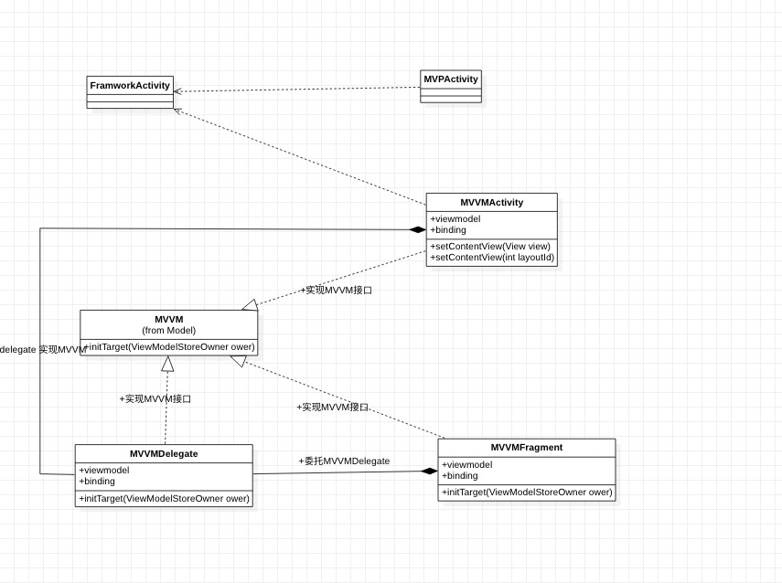

# Satis - core

> core 为Satis 框架的核心库，框架中的其余各个组件都依赖于核心库

-  各组件基类 
    - FrameworkActivity
    - FrameworkFragment
    - 插件式Dialog 
    - 等等
-  基础模式实现
    - mvvm
-  ktx 拓展
-  开发常见 utils 
-  FrameworkApplication 
    - 该类为上层模块提供便捷性质的初始化。如ActivityStack 管理，全局上下文 

